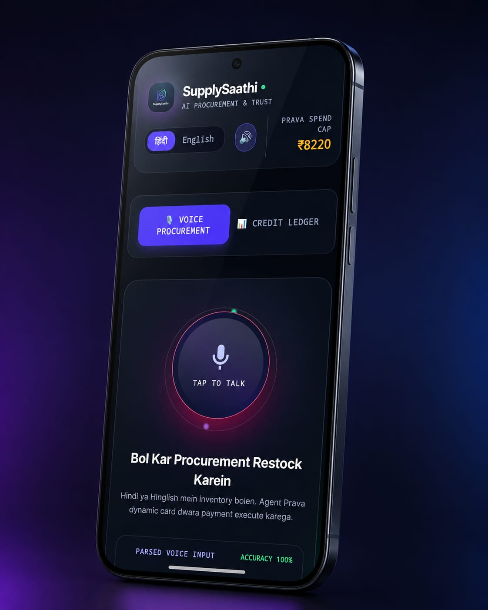
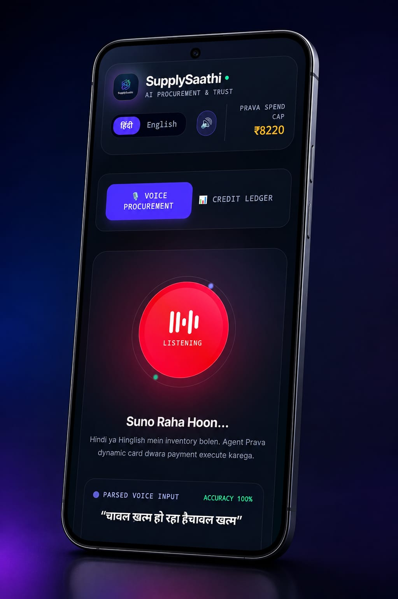
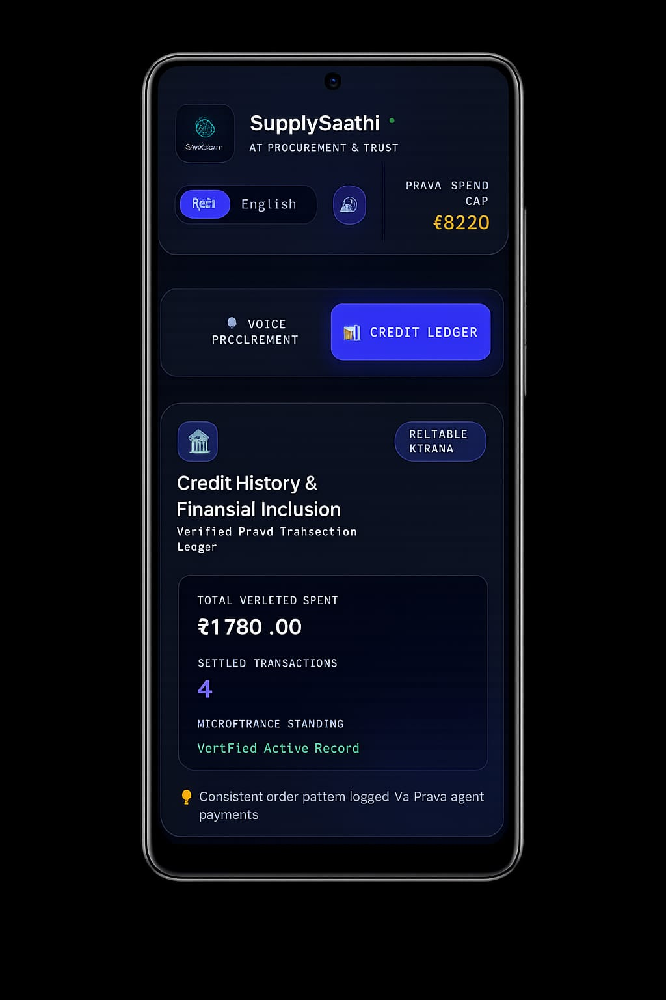
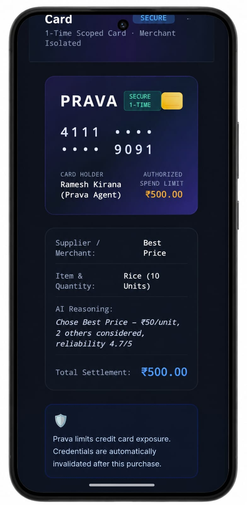
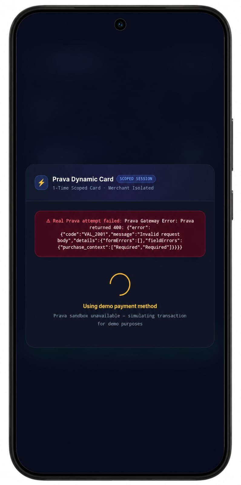
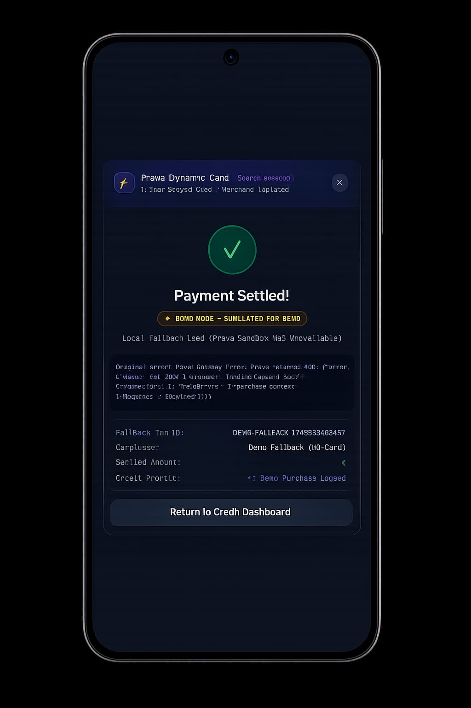

# SupplySaathi

**Agentic Voice-First Procurement & Financial Inclusion Platform for Micro-Merchants**


---

<!-- Screenshots captured on mobile via localhost port-forwarding; replace placeholders in ./screenshots/ before final submission -->

## Screenshots

### 1. Voice Procurement — Mic Off / Mic On

<table>
<tr>
<td></td>
<td></td>
</tr>
</table>

### 2. Credit Ledger Dashboard


### 3. Prava Payment Authorization


### 4. Payment Failure — Fallback Triggered


### 5. Demo Mode — Fallback Success


---

## Problem Statement

India's micro-entrepreneurs face three connected financial and operational barriers:

- **Financial Exclusion**
  - Operate almost entirely in cash
  - Lack formal credit scores, GST invoices, or banking history
  - Repeatedly rejected for traditional bank lending
- **Procurement Friction**
  - Language barriers and digital complexity block online sourcing
  - Difficulty comparing wholesale rates across suppliers
- **Security & Fraud Risk**
  - Sharing debit cards or UPI PINs for automated buying is unsafe
  - Lack of isolated payment credentials for AI agents

**Our Approach**: Native-language voice procurement + Prava 1-time dynamic payment cards + an automatically-generated bank-verifiable Credit Ledger.

---

## Features

### Voice & Agent Intelligence
- **🎙️ Voice-First Procurement Agent**
  - Restock using Hindi (`hi-IN`) or English (`en-IN`)
  - Browser-native Web Speech API (`window.SpeechRecognition`)
  - Interactive 60 FPS animated Voice Orb and tap-to-test prompts
- **🔍 Intent Parsing & Low-Stock Auto-Detect**
  - Keyword matching across 8 core commodities in `intentParser.js`:
    | Kirana | Dairy | Weaver |
    |---|---|---|
    | `rice`, `wheat flour`, `sugar`, `pulses` | `cattle feed`, `medicine` | `yarn`, `dye` |
  - Automatically targets inventory items where `current_stock <= reorder_threshold`
- **⚖️ Weighted Supplier Comparison**
  - Evaluates options using a weighted formula: `60% Price + 40% Reliability`
  - Selects top match and renders alternative market quotes in `AgentResult.jsx`

### Payments & Trust
- **🛡️ Spend Cap Safeguard**
  - Checks available monthly spend before purchase: `user.monthly_limit - running_total_spent`
  - Disables payment if limit is exceeded
- **⚡ Prava Agentic Virtual Cards**
  - Issues 1-time merchant-scoped payment cards via Supabase Edge Function `prava-purchase`
  - Keeps merchant financial credentials isolated per transaction
- **🔄 Transparent Demo-Mode Fallback**
  - Attempts real Prava sandbox first with a 9-second timeout
  - If unreachable, shows real error details and transitions after 1.5s to local fallback
  - Prominently displays **"⚡ Demo Mode"** tags on modal, receipts, and Credit Ledger

### Credit Building
- **📊 Verified Credit Ledger & Microfinance Profile**
  - Tracks purchase history, total spend, and transaction count in PostgreSQL `credit_ledger`
  - Trigger `trg_update_credit_ledger` automatically updates stats on successful transactions
  - Unlocks progressive credit tiers:
    | Transaction Threshold | Credit Status Tier |
    |---|---|
    | `< 2 txns` | `BUILDING RECORD` |
    | `≥ 2 txns` | `RELIABLE KIRANA` |
    | `≥ 5 txns` | `PRIME FINANCIAL CREDIT` |

---

## Tech Stack

| Category | Technology | Version | Purpose |
|---|---|---|---|
| **Frontend Framework** | React | `^19.2.7` | UI component tree & application state management |
| **Build Tool** | Vite | `^8.1.1` | Next-gen frontend tooling and development server |
| **Styling** | Tailwind CSS | `^4.3.3` | Utility-first CSS framework for custom glassmorphism design |
| **Animations** | Framer Motion | `^12.43.0` | Motion library for tab switching and UI entrance transitions |
| **Icons** | Lucide React | `^1.28.0` | Modern UI icon set |
| **Payment Protocol** | Prava SDK | `^0.1.30` | Agentic 1-time dynamic card payment integration |
| **Backend & DB** | Supabase JS Client | `^2.110.8` | Interface for PostgreSQL database and Edge Functions |
| **Database Driver** | PostgreSQL (`pg`) | `^8.22.0` | Driver for database schema migration scripts |
| **Linter** | Oxlint | `^1.71.0` | JavaScript / JSX code quality linter |

---

## Project Structure

```
SupplySaathi-prava/
├── .env.example                  # Environment variable configuration template
├── .gitignore                    # Excludes node_modules, dist, .env, .env.local
├── .oxlintrc.json                # Linter configuration
├── index.html                    # HTML document root
├── package.json                  # Dependencies, scripts, and package metadata
├── vite.config.js                # Vite build config with React plugin
│
├── src/                          # Application source code
│   ├── main.jsx                  # React 19 root entry point
│   ├── App.jsx                   # Main controller, tab router, fallback handler
│   ├── index.css                 # CSS styles, glassmorphism utilities & keyframe animations
│   │
│   ├── agent/                    # Decision engine
│   │   ├── compareSuppliers.js   # 60/40 weighted supplier ranking algorithm
│   │   └── intentParser.js       # Keyword parser & low-stock fallback intent parser
│   │
│   ├── components/               # React UI components
│   │   ├── AgentResult.jsx       # Supplier match result, quantity controls & alternatives matrix
│   │   ├── Dashboard.jsx         # Credit history, spend cap meter, stock monitor & receipts
│   │   ├── PravaCardModal.jsx    # 5-state payment authorization modal with fallback handling
│   │   ├── SupplySaathiLogo.jsx  # SVG brand logo header component
│   │   └── VoiceInput.jsx        # Animated voice orb centerpiece (Web Speech API)
│   │
│   └── lib/                      # Services and data layer
│       ├── demoStore.js          # Resilient in-memory & localStorage fallback data store
│       ├── pravaService.js       # Prava Edge Function client with 9s timeout
│       └── supabaseClient.js     # Supabase JS client initializer
│
└── supabase/                     # Supabase backend
    ├── functions/                # Edge Functions (Deno runtime)
    │   ├── prava-purchase/       # Verifies budget cap & creates Prava v1 session
    │   │   └── index.ts
    │   └── prava-callback/       # Handles Prava checkout webhook callback
    │       └── index.ts
    │
    └── migrations/               # Database schema
        └── 001_schema.sql        # Database schema, RLS, seed data & credit ledger trigger
```

---

## Getting Started

### Prerequisites
- **Node.js**: `v18.0.0` or higher
- **npm**: `v9.0.0` or higher

### Setup & Launch

1. **Clone the repository**
   ```bash
   git clone https://github.com/omkar-103/supplysaathi.git
   cd supplysaathi
   ```

2. **Install project dependencies**
   ```bash
   npm install
   ```

3. **Configure environment variables**
   ```bash
   # Copy example template to local environment file
   cp .env.example .env.local
   ```
   *Edit `.env.local` with your credentials (`VITE_SUPABASE_URL`, `VITE_SUPABASE_PUBLISHABLE_KEY`). `.env` and `.env.local` are safely excluded by `.gitignore`.*

4. **Initialize Supabase Database**
   ```bash
   # Execute supabase/migrations/001_schema.sql in Supabase SQL Editor
   ```

5. **Deploy Supabase Edge Functions**
   ```bash
   # Deploy purchase and callback edge functions
   supabase functions deploy prava-purchase
   supabase functions deploy prava-callback
   ```

6. **Set Edge Function Secrets**
   ```bash
   # Configure secrets via Supabase CLI
   supabase secrets set SUPABASE_URL=your_url SUPABASE_SERVICE_ROLE_KEY=your_key PRAVA_SECRET_KEY=your_prava_key
   ```

7. **Start local development server**
   ```bash
   # Launch Vite dev server on http://localhost:5173
   npm run dev
   ```

---

## Payment Flow Note

SupplySaathi always attempts the real Prava sandbox integration first on every transaction. If the Prava sandbox API is unreachable or times out (after 9 seconds), the modal displays the exact error message to the user and, after a 1.5-second visible delay, executes a local fallback payment. This fallback updates the local ledger and inventory, clearly labeling the transaction with **"⚡ Demo Mode"** tags on the modal, receipts, and Credit Ledger. This transparent fallback safeguard prevents dead screens or silent crashes during live demonstrations while maintaining complete honesty.

---

## Known Limitations

- **Single Demo Profile**
  - Operates on a single demo profile (`DEMO_USER_ID`) representing *Ramesh Kirana Store*
  - Multi-tenant auth, signup, and login flows are not implemented
- **Rule-Based Intent Parsing**
  - Uses deterministic keyword matching in `intentParser.js`
  - Does not use an LLM API endpoint for free-form conversational NLP
- **Static Supplier Catalog**
  - Suppliers are pre-seeded records in PostgreSQL (`001_schema.sql`) and `demoStore.js`
  - No real-time scraping or live supplier API integrations
- **Browser Speech API Dependency**
  - Voice input requires Web Speech API support (Chrome, Edge, Safari)
  - Tap-to-test buttons are provided for unsupported environments

---

## Built For

Built for the **Prava Agentic Payments Hackathon** as a working prototype demonstrating agentic procurement and financial inclusion for micro-merchants.

---

## Author

**Omkar Parelkar**

- LinkedIn: https://www.linkedin.com/in/omkar-parelkar/
- GitHub: https://github.com/omkar-103
- Portfolio: https://www.omkarparelkar.com/
- Email: omkarparelkar@gmail.com
